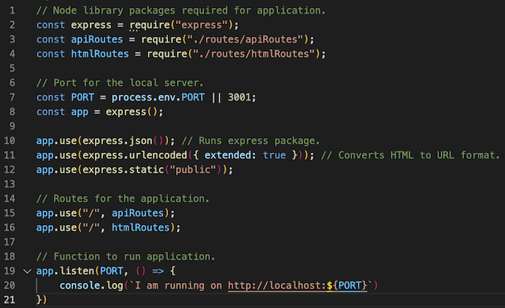
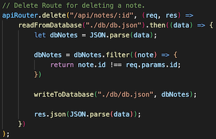

# Note Taker

## Description 

This is an application that stores notes. Write a note with a title and a body and save it to a database with a click. Then reference it from a list on the left side. You can also delete the note here. The application starts up using Express.JS. Express is a node js web application framework that provides features for building web applications. I then depoloyed it to heroku.  The file server.js is the main page. It connects to the server and connects to the routes folder. The routes folder then connects to the public html folder and the api routes for writing and deleting a new note. This is seen here:

This code here is used for deleting a note from the page. 

## Installation

Install npm via "npm i" in the command line. A folder named node_modules will populate as well as a package-lock.json. This shows proper steps are happening. Open the directory in the intergrated terminal or terminal you are using. Run the index.js file using node, i.e. "npm start". A notification will console log with success and a link to the server.  

## Usage 

First click on the "Get Started" button to be taken to the notes page. Once on the notes page, either select a previous note on the left to view or start a new note. To start a new note, enter a title and a body of the note. Then click the save icon in the top right to save the note. You can also press the + sign in the top left to open a new note. 

This can be used on a heroku deployed server here: 

<a href="https://shielded-island-42238.herokuapp.com/" target="_blank">Note Taker on Heroku</a>

## Credits

Node.js, inquirer, express.js, Heroku, UCB Starter Code

## Contact Me

<a href="https://www.linkedin.com/in/tyler-dinslage-profile/" target="_blank">LinkedIN Profile</a>

<a href="https://github.com/tylerdins88?tab=repositories" target="_blank">Github Repo</a>

## License

Listed in repo file. 